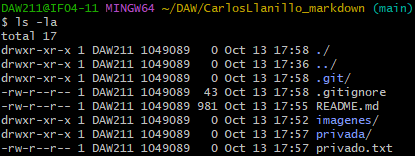
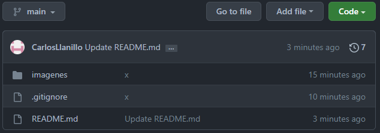

# CarlosLlanillo_markdown

## Explicacion comandos git

### Archivo .gitignore
Creamos una carpeta **privada** y un fichero **privado.txt**
```
mkdir privada
nano privado.txt
```
Despues creamos el fichero .gitignore
```
nano .gitignore
```
Y añadimos los ficheros que queremos ocultarle a git
```
# Elementos a ignorar
privado.txt
privada
```
Y ahora simplemente cuando subamos un commit nuevo estos archivos no se subiran
###
 
###

