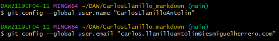
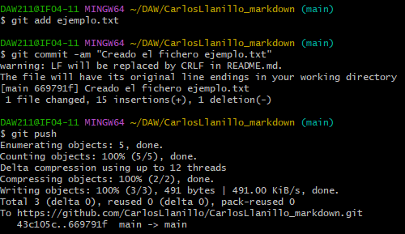

# CarlosLlanillo_markdown

## Explicacion comandos git

###Global config
Configura las variables del nombre y usuario para todos los repositorios 
del usuario
```
git config --global user.name "CarlosLlanilloAntolin"
git config --global user.email "carlos.llanilloantolin@iesmiguelherrero.com"
```


## Añadir fichero y primer commit
```
mkdir ejemplo.txt
git add ejemplo.txt
git commit -am "Creado el fichero ejemplo.txt"
git push
```


## Editar fichero
Primero le cambiamos el contenido al archivo y despues subimos los cambios
a nuestro repositorio
```
git commit -am "Cambiado el fichero ejemplo.txt";
git push
```

## Cambiar el nombre con git mv
```
git mv ejemplo.txt ejemplo2.txt
git commit -am "Cambiado el nombre del fichero de ejemplo a ejemplo2"
git push
```

## Borrando el fichero de git
```
git rm ejemplo2.txt
git commit -am &quot;Borrado el fichero ejemplo2&quot;
git push
```

